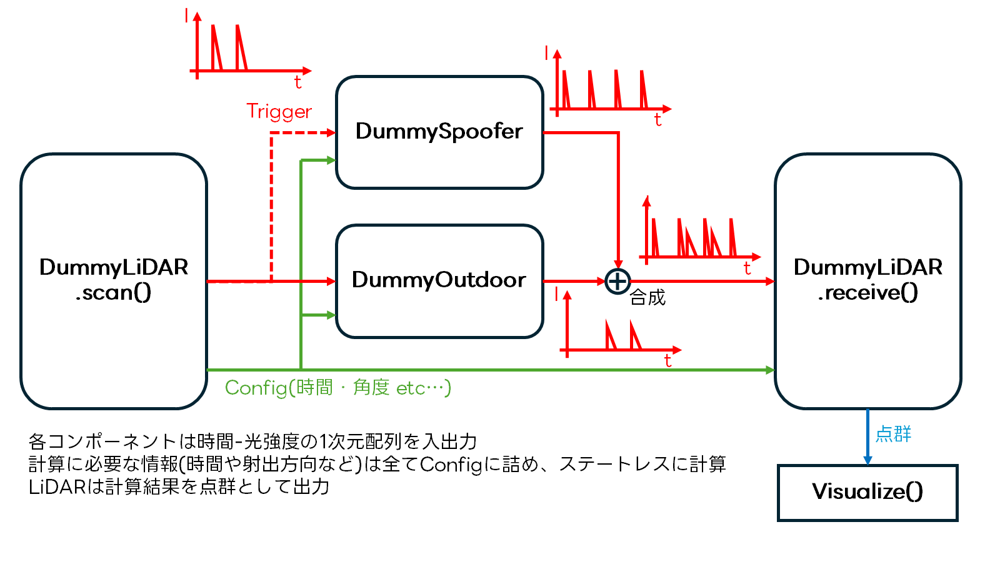

# SPAAL v2

* Simulator of the Physical Attack Against LiDARsの略
* Spoofing AttackとLiDARのToF信号処理をシミュレーションします

# 仕組み

* ToF距離計算に用いられる光を時間-強度の1次元データとしてモデル化
* LiDARの測距ごとに反射波形とその時間の攻撃波形をシミュレート、合成波形からToFを計算




# Getting Started

1. [uv](https://docs.astral.sh/uv/)をインストール
2. `git clone git@github.com:Keio-CSG/spaal2-core.git`
3. `uv run example/ahfr.py`

# Hist-matrix とは
Altitude x Azimuth x Histdata の形式でLiDARのHistgramを表現する行列。

## Hist-matrix 生成方法 (例)
出力される.npzファイルには、hist-data本体、入力の.pcdファイルの先頭行の点群(=LiDARの最初のスキャンとなる点)の世界座標に対する水平Offset角度、LiDARの垂直角の方向のリスト、LiDARのFoV(360°LiDARなら360)、時間分解能(ns)を含む。
```
uv run python datasets_generator/hist_matrix_generator.py --lidar-type PCD_VLP16 --pcd-file "C:/Users/nextr/spaal2-core/example/1464001237.670017000.pcd" --num-frames 1 --output-dir ./pcd_datasets --time-resolution-ns 0.2
```

## Hist-matrix -> pointcloud 変換方法
```
uv run datasets_generator/hist_matrix_visualizer.py --pcd-file "C:/Users/nextr/spaal2-core/example/1464001237.670017000.pcd" --npz-file "C:/Users/nextr/spaal2-core/pcd_datasets/lidar_signal.npz"
```